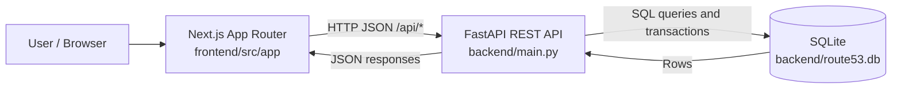
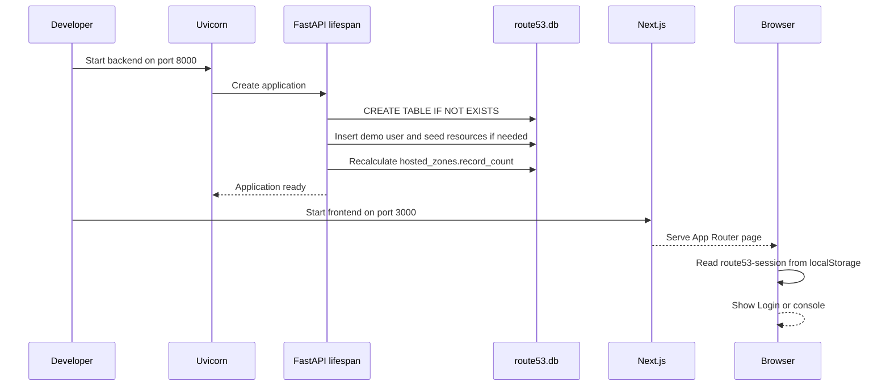
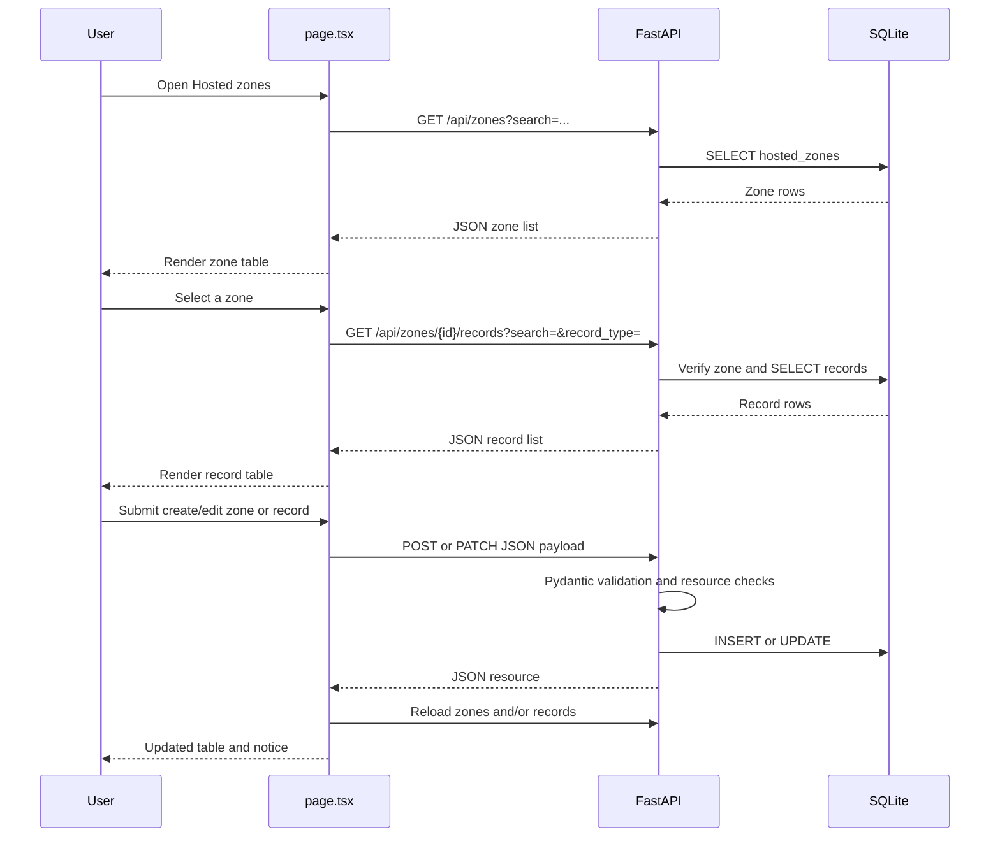
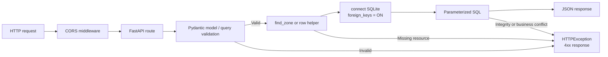
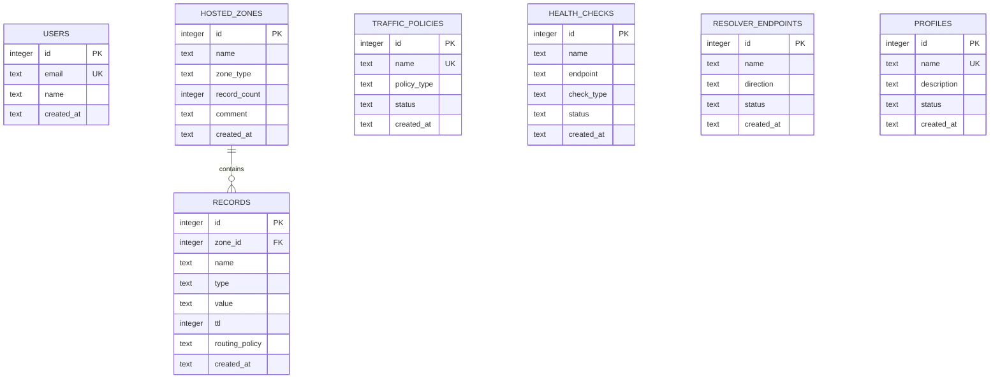
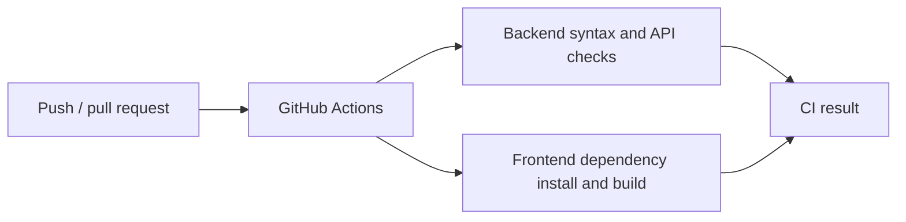

# Route 53 Console Clone Architecture

## 1. System Overview

This project is a local full-stack clone of an AWS Route 53 management console.

- The **Next.js frontend** renders the console UI and owns browser state.
- The **FastAPI backend** exposes REST endpoints, validates request payloads, and performs database operations.
- **SQLite** stores users, hosted zones, DNS records, and supporting Route 53 resources.
- The browser calls the backend directly over HTTP. There is no Next.js API proxy.
- Authentication is mocked for the demo: the frontend stores a local-storage flag, while the backend exposes compatible auth endpoints.



## 2. Repository Structure

```text
/
├── README.md                         Project setup and API summary
├── ARCHITECTURE.md                   This architecture and flow document
├── backend/
│   ├── main.py                       FastAPI app, schemas, routes, SQL, seed data
│   ├── requirements.txt              Python dependencies
│   └── route53.db                    Generated SQLite database at runtime
├── frontend/
│   ├── package.json                  Next.js, React, TypeScript scripts/dependencies
│   ├── tsconfig.json                 Strict TypeScript configuration
│   └── src/app/
│       ├── layout.tsx                Root HTML layout and metadata
│       ├── page.tsx                  Main client UI, state, API calls, views, modals
│       └── globals.css                Global console layout and responsive styles
└── .github/workflows/ci.yml          CI checks for backend and frontend
```

## 3. Runtime Startup Flow



### Database initialization

`initialize_database()` runs once during the FastAPI lifespan startup. It:

1. Creates all tables if they do not exist.
2. Enables SQLite foreign keys for each connection.
3. Inserts the demo user `demo@route53.local` if absent.
4. Seeds `example.com` and four initial DNS records when no hosted zones exist.
5. Recalculates every hosted zone's stored `record_count`.
6. Seeds one traffic policy, health check, resolver endpoint, and profile when absent.

The database file is created at `backend/route53.db` automatically and is not needed in source control.

## 4. Frontend Architecture

### Root rendering

`frontend/src/app/layout.tsx` is the root layout. It loads global CSS and defines page metadata. The page itself is implemented in `frontend/src/app/page.tsx`.

`page.tsx` is a client component because it uses React state, effects, browser localStorage, confirmation dialogs, and fetch calls.

### Main frontend state

| State | Purpose |
|---|---|
| `authenticated` | Controls whether Login or the console is rendered |
| `zones` | Hosted zones returned by `/zones` |
| `selectedZone` | Zone whose records are shown |
| `records` | Records returned for the selected zone |
| `zoneSearch` | Hosted zone search term |
| `recordSearch` / `recordFilter` | Record search and type filter |
| `activeNav` | Current console section |
| `dashboard`, `trafficPolicies`, `healthChecks`, `resolverEndpoints`, `profiles` | Data for secondary sections |
| `modal` / `editing` | Create/edit modal mode and selected resource |
| `notice` | Temporary success or error message |
| `page` | Client-side hosted-zone pagination page |

### Frontend data flow

```mermaid
flowchart TD
    Mount[Home component mounts]
    Session{localStorage route53-session = active?}
    Login[Render Login]
    Console[Render console shell]
    Zones[loadZones]
    ZoneAPI[GET /api/zones?search=...]
    Select[User selects hosted zone]
    Records[loadRecords]
    RecordAPI[GET /api/zones/{zone_id}/records]
    Nav[User selects secondary navigation]
    FeatureAPI[GET /api/dashboard or feature endpoint]
    Modal[Create/Edit modal submit]
    Mutate[POST/PATCH/DELETE]
    Refresh[Reload affected state]

    Mount --> Session
    Session -->|No| Login
    Session -->|Yes| Console
    Login -->|Set localStorage flag| Console
    Console --> Zones --> ZoneAPI
    Console --> Select --> Records --> RecordAPI
    Console --> Nav --> FeatureAPI
    Console --> Modal --> Mutate --> Refresh
    Refresh --> Zones
    Refresh --> Records
```

### Authentication flow

1. The initial browser render checks `localStorage` for `route53-session = active`.
2. If absent, the frontend displays the demo login form.
3. Clicking **Sign in** sets the local-storage flag and changes local React state.
4. No backend login request is made by the current login button.
5. Clicking **Sign out** removes the flag and returns to the login screen.
6. The backend still provides `POST /api/auth/login`, `POST /api/auth/logout`, and `GET /api/auth/me`; these routes currently do not enforce a token on other endpoints.

### Hosted zone and record flow



### UI sections

- **Dashboard** loads aggregate counts from `/dashboard`.
- **Hosted zones** supports search, client-side pagination, create, edit, delete, and selection.
- **Records** supports search, type filtering, create, edit, and delete for the selected zone.
- **Traffic policies**, **Health checks**, **Resolver**, and **Profiles** load their list endpoints and render a shared table component.
- The create buttons in the secondary resource views are currently disabled in the frontend, although some corresponding backend POST routes exist.

## 5. Backend Architecture

`backend/main.py` contains the complete backend in one module:

```text
FastAPI application
├── lifespan / initialize_database
├── SQLite connection helpers
├── Pydantic request models
├── row conversion and hosted-zone lookup helpers
├── health and dashboard routes
├── authentication routes
├── hosted-zone CRUD routes
├── DNS-record CRUD routes
└── supporting resource list/create routes
```

### Request handling pipeline



### Validation and business rules

- Zone names are normalized to end with a trailing dot before storage.
- Duplicate hosted zones return `409`.
- Record types are restricted to `A`, `AAAA`, `CNAME`, `TXT`, `MX`, `NS`, `PTR`, `SRV`, `CAA`, and `SOA`.
- Record TTL must be between `0` and `2147483647`.
- Missing hosted zones and records return `404`.
- Creating a record increments `hosted_zones.record_count`.
- Deleting a record decrements `record_count`, never below zero.
- Deleting a hosted zone cascades to its records through the foreign key.
- Duplicate traffic policy and profile names return `409`.
- SQLite writes use the connection context manager, which commits successful operations and rolls back failures.

## 6. API Surface

All routes are prefixed with `/api`.

| Group | Routes | Purpose |
|---|---|---|
| System | `GET /health` | Backend liveness check |
| Dashboard | `GET /dashboard` | Counts resources and reports SQLite/API status |
| Auth | `POST /auth/login`, `POST /auth/logout`, `GET /auth/me` | Mock authentication helpers |
| Hosted zones | `GET /zones`, `POST /zones`, `PATCH /zones/{zone_id}`, `DELETE /zones/{zone_id}` | Hosted-zone CRUD and search |
| Records | `GET /zones/{zone_id}/records`, `POST /zones/{zone_id}/records`, `PATCH /zones/{zone_id}/records/{record_id}`, `DELETE /zones/{zone_id}/records/{record_id}` | DNS record CRUD, search, and type filtering |
| Traffic policies | `GET /traffic-policies`, `POST /traffic-policies` | List/create traffic policies |
| Health checks | `GET /health-checks`, `POST /health-checks` | List/create health checks |
| Resolver | `GET /resolver/endpoints` | List resolver endpoints |
| Profiles | `GET /profiles`, `POST /profiles` | List/create profiles |

### API URL resolution

The frontend uses:

```text
NEXT_PUBLIC_API_URL || http://localhost:8000/api
```

The backend allows browser requests from `http://localhost:3000` and `http://127.0.0.1:3000` through CORS.

## 7. Data Model



Only `records.zone_id -> hosted_zones.id` is relationally connected. The other resource tables are independent demo collections.

## 8. Local Development Flow

Run the two applications independently from the repository root:

```powershell
# Backend
cd backend
python -m venv .venv
.\.venv\Scripts\Activate.ps1
pip install -r requirements.txt
uvicorn main:app --reload --port 8000

# Frontend, in another terminal
cd frontend
npm install
npm run dev
```

- Frontend: `http://localhost:3000`
- Backend: `http://localhost:8000`
- Interactive FastAPI docs: `http://localhost:8000/docs`
- Health check: `http://localhost:8000/api/health`

## 9. CI Flow

The GitHub Actions workflow runs backend checks and the frontend build. The frontend build validates TypeScript/Next.js compilation; backend checks validate Python syntax and API smoke behavior as configured in `.github/workflows/ci.yml`.



## 10. Current Boundaries and Extension Points

- Authentication is a UI-only mock and should be replaced with token/session validation before production use.
- The frontend currently centralizes all UI, API access, and resource views in `page.tsx`; larger features would benefit from extracting API clients, hooks, and components.
- Most backend routes open a fresh SQLite connection per request, which is appropriate for this local demo but not a scalable production persistence strategy.
- Traffic policies, health checks, and profiles have backend create routes, but the current frontend only exposes read-only tables for those sections.
- No external AWS Route 53 calls are made. All data is local and simulated.
