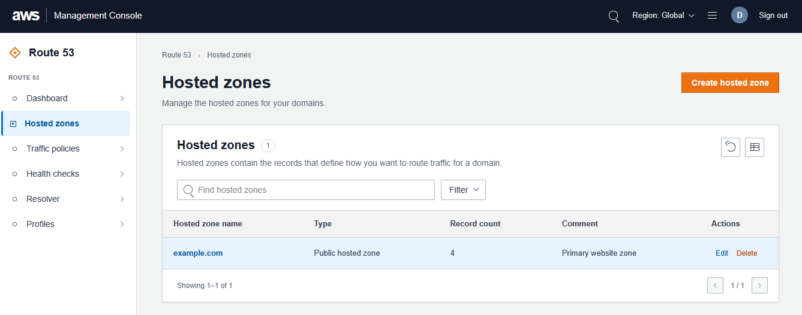
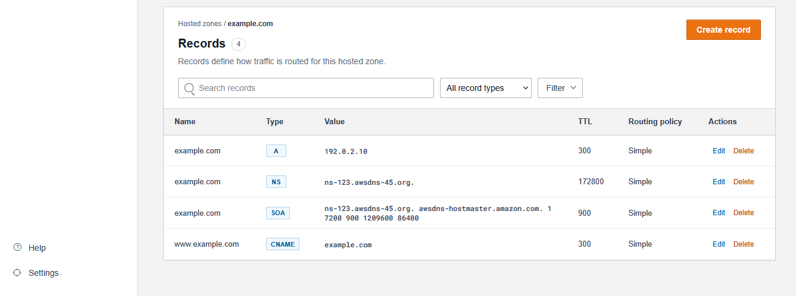

# AWS Route 53 Clone

A full-stack AWS Route 53 experience built for the Scaler SDE full-stack assignment. It recreates the hosted-zone and DNS-record workflows with mocked authentication, a FastAPI backend, and SQLite persistence.

### Hosted zones



### DNS records



## Requirements

- Python 3.11+
- Node.js 20+
- npm 10+

## Run locally

Open two terminals from the repository root.

### Backend

```powershell
cd backend
python -m venv .venv
.\.venv\Scripts\Activate.ps1
pip install -r requirements.txt
uvicorn main:app --reload --port 8000
```

The API runs at `http://localhost:8000`. Interactive API documentation is available at `http://localhost:8000/docs`.

### Frontend

```powershell
cd frontend
npm install
npm run dev
```

Open `http://localhost:3000`. The frontend defaults to `http://localhost:8000/api`; set `NEXT_PUBLIC_API_URL` when the API is hosted elsewhere.

The demo login is mocked and uses `demo@route53.local`.

## Architecture

- `frontend/`: Next.js App Router, TypeScript, client-side console UI.
- `backend/`: FastAPI REST API and SQLite database access.
- `.github/workflows/ci.yml`: backend syntax/API smoke checks and frontend build.

The browser calls FastAPI directly. SQLite is created automatically at `backend/route53.db` on first startup. The API seeds one demo hosted zone and common records if the database is empty.

## Database schema

- `users`: mocked authenticated users.
- `hosted_zones`: zone name, type, comment, record count, and creation timestamp.
- `records`: zone foreign key, DNS name, record type, value, TTL, routing policy, and creation timestamp.

Deleting a hosted zone cascades to its records. The stored `record_count` is updated on record creation and deletion.

## API overview

- `GET /api/health`
- `GET /api/dashboard`
- `POST /api/auth/login`
- `POST /api/auth/logout`
- `GET /api/auth/me`
- `GET /api/zones?search=`
- `POST /api/zones`
- `PATCH /api/zones/{zone_id}`
- `DELETE /api/zones/{zone_id}`
- `GET /api/zones/{zone_id}/records?search=&record_type=`
- `POST /api/zones/{zone_id}/records`
- `PATCH /api/zones/{zone_id}/records/{record_id}`
- `DELETE /api/zones/{zone_id}/records/{record_id}`
- `GET /api/traffic-policies` and `POST /api/traffic-policies`
- `GET /api/health-checks` and `POST /api/health-checks`
- `GET /api/resolver/endpoints` and `POST /api/resolver/endpoints`
- `GET /api/profiles` and `POST /api/profiles`

Supported record types are A, AAAA, CNAME, TXT, MX, NS, PTR, SRV, CAA, and SOA for the seeded authoritative record.
